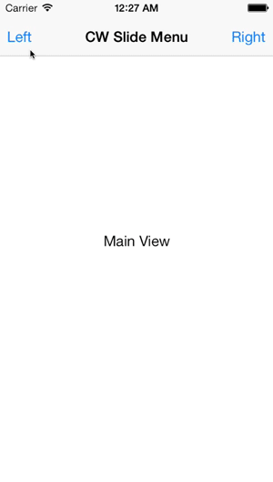
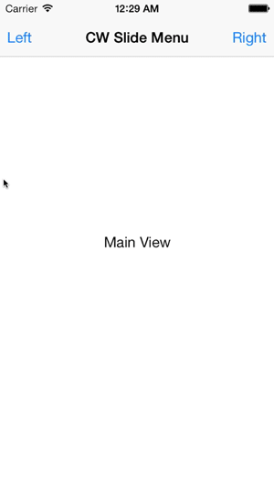

# CWSlideMenuController

`CWSlideMenuController` is a view controller that implements the familiar slide menu funcionality using iOS 7's UIKit Dynamics. The result is a simpler slide menu controller that feels more satisfying to use.

This control is a work in progress.

## Requirements

`CWSlideMenuController` requires iOS 7+ and uses ARC.

It currently only supports portrait orientation on iPhones.

## Installation

### Manual

Copy the CWSlideMenuController folder to your project.

## Usage

Below is a sample usage of this control.

    // make view controllers
    CWSlideMenuController *slideMenuControler = [CWSlideMenuController new];
    CWLeftViewController *leftViewController = [[CWLeftViewController alloc] initWithNibName:@"CWLeftViewController" bundle:nil];
    CWMainViewController *mainViewController = [[CWMainViewController alloc] initWithNibName:@"CWMainViewController" bundle:nil];
    CWRightViewController *rightViewController = [[CWRightViewController alloc] initWithNibName:@"CWRightViewController" bundle:nil];

    // assign view controllers in slide menu controller
    slideMenuControler.leftViewController = leftViewController;
    slideMenuControler.mainViewController = mainViewController;
    slideMenuControler.rightViewController = rightViewController;

    // link actions
    mainViewController.btnLeft.target = slideMenuControler;
    mainViewController.btnLeft.action = @selector(leftViewControllerButton);
    mainViewController.btnRight.target = slideMenuControler;
    mainViewController.btnRight.action = @selector(rightViewControllerButton);

## License

    The MIT License (MIT)

    Copyright (c) 2013 Cezary Wojcik <http://www.cezarywojcik.com>

    Permission is hereby granted, free of charge, to any person obtaining a copy
    of this software and associated documentation files (the "Software"), to deal
    in the Software without restriction, including without limitation the rights
    to use, copy, modify, merge, publish, distribute, sublicense, and/or sell
    copies of the Software, and to permit persons to whom the Software is
    furnished to do so, subject to the following conditions:

    The above copyright notice and this permission notice shall be included in
    all copies or substantial portions of the Software.

    THE SOFTWARE IS PROVIDED "AS IS", WITHOUT WARRANTY OF ANY KIND, EXPRESS OR
    IMPLIED, INCLUDING BUT NOT LIMITED TO THE WARRANTIES OF MERCHANTABILITY,
    FITNESS FOR A PARTICULAR PURPOSE AND NONINFRINGEMENT. IN NO EVENT SHALL THE
    AUTHORS OR COPYRIGHT HOLDERS BE LIABLE FOR ANY CLAIM, DAMAGES OR OTHER
    LIABILITY, WHETHER IN AN ACTION OF CONTRACT, TORT OR OTHERWISE, ARISING FROM,
    OUT OF OR IN CONNECTION WITH THE SOFTWARE OR THE USE OR OTHER DEALINGS IN
    THE SOFTWARE.
